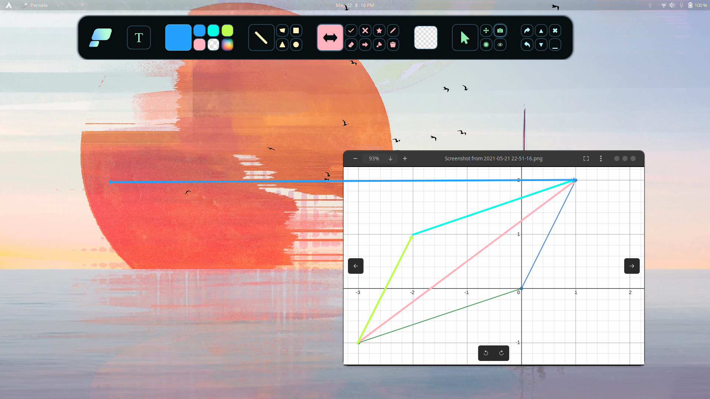

---

# Pensela: The Swiss Army Knife of Screen Annotation Tools

## Features
- Basic Shapes
    - Rectangle
    - Circle 
    - Triangle
    - Lines (Straight and Freehand)
    - Any Polygon
- Stickers: Pre Added Shapes
    - Star
    - Cross
    - Tick
    - Single and Double Sided Arrows
- Highlighter
- Laser Pointer
- Screenshot Tool     
- Text Support
- Backgound Pages
- Custom Color Picker &nbsp;
- And More ... 

## Screenshots

A Promo / Demo can be found [here](https://youtu.be/OzpgCw24ut8)

## Installation
**Packages can be Found in the [releases](https://github.com/weiameili/Pensela/releases) Section**

**Note**: Imagemagick is required for screenshots on linux and screenshots are not guaranteed to work on wayland as of now.

| OS | Instructions |
| ------------- | ------------- |
| Debian Based Linux  | A .deb archive has been provided  |
| Arch Linux  | Arch user can install the [pensela-bin](https://aur.archlinux.org/packages/pensela-bin/) aur package or the prebuilt package archive provided in the releases section  |
| Other Linux  | An AppImage has been provided  |
| Windows  | Download and run the setup provided in the releases section. You will have to disable your antivirus and / or mark the setup as safe  |
| Mac OS  | A dmg has been provided. Or use Homebrew: `brew install --cask pensela` |

## Features to be Added in Future Versions
- Better UX
- Auto Updates
- Guided "Getting Started" Tour
- Add more Features
    - Full-fledged Screen Recording Tool
    - Better Text Support
    - Seperate Colors For Stroke and Fill
    - Better Laser Pointer

## Contributing
Any kind of contribution is welcome
1. Fork the Project
2. Install the dependencies with npm
3. Create your Feature Branch 
4. Commit your Changes 
5. Push to the Branch 
6. Open a Pull Request

Feel free to report an issue or request a feature in the Issues Section.

### Conributors

## License
Distributed under the ISC License.
